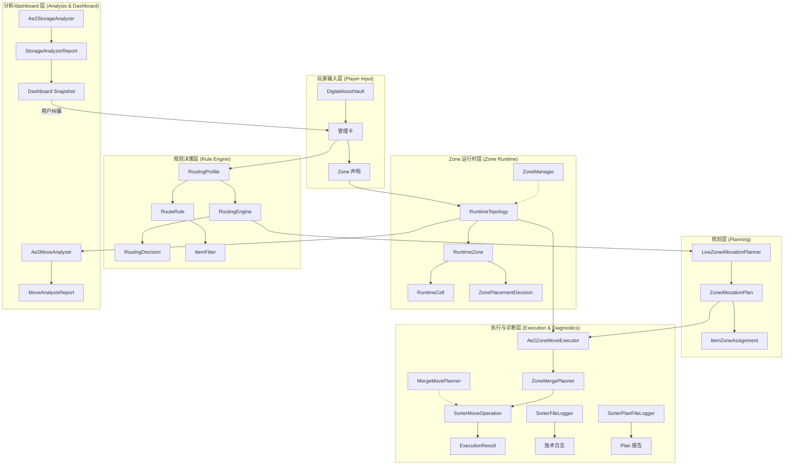
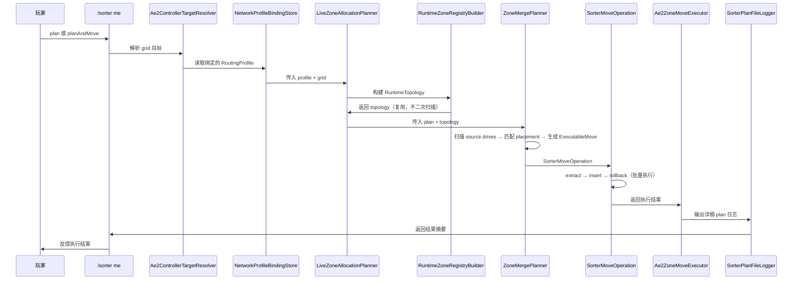
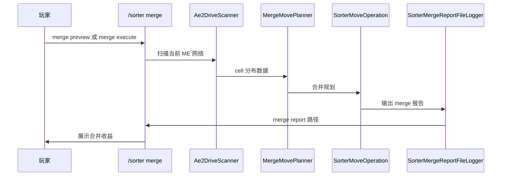
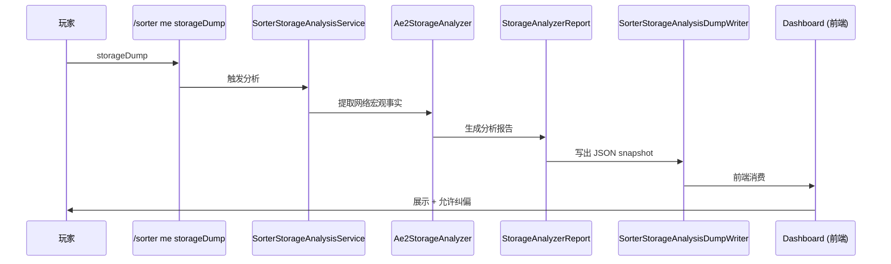
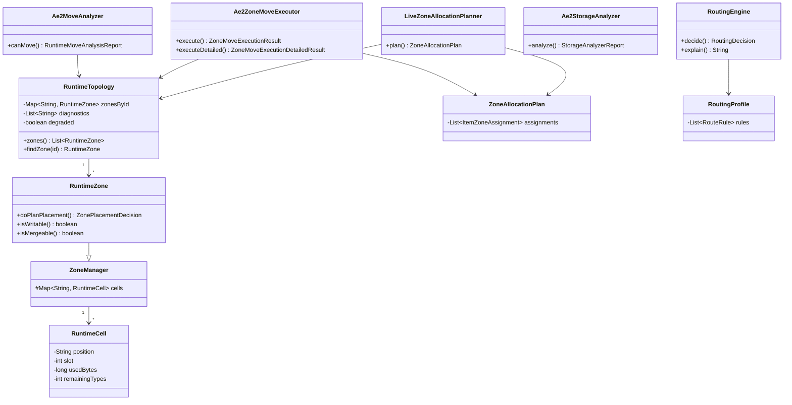

# 架构参考手册 (Architecture Reference)

> 本文档是 Applied Storage Sorter 的完整架构参考。面向开发者和 AI 协作者，提供全景视图。
> 阅读顺序建议：术语表 → 本文档 → 整体逻辑 → 类职责总览

---

## 1. 项目定位

**Applied Storage Sorter** 是一个 Minecraft NeoForge 模组（v1.21.1），为 AE2 (Applied Energistics 2) 提供存储治理能力。

### 两条能力线

```
┌─────────────────────────────────────────────────┐
│              Applied Storage Sorter              │
├──────────────────────┬──────────────────────────┤
│  自动整理 (Merge)     │  自动搬运 (Zone治理)      │
│                      │                          │
│  /sorter merge       │  /sorter me bindProfile  │
│  同类归并             │  /sorter me plan         │
│  无配置即可用         │  /sorter me planAndMove  │
│                      │  需 DAV + 管理卡配置      │
└──────────────────────┴──────────────────────────┘
```

### 当前限制
- ✅ 仅面向 **AE2 内部 drive 存储**
- ✅ 支持的 drive 方块：`ae2:drive`、`extendedae:ex_drive`
- ❌ 不处理 external storage、storage bus、drawer

---

## 2. 六层架构



### 2.1 玩家输入层

| 维度 | 说明 |
|------|------|
| **职责** | 让玩家声明 zone，让 DAV 成为 zone 容器，让输入具有可视化和可持久化形式 |
| **核心类** | `DigitalAssetVaultBlock`, `DigitalAssetVaultBlockEntity`, `DigitalAssetManagementCardItem`, `DigitalAssetVaultMenu`, `DigitalAssetVaultScreen`, `ZoneStampedManagementCardRecipe` |
| **不负责** | 路由决策、搬运执行 |
| **包路径** | `block/`, `blockentity/`, `item/`, `menu/`, `client/screen/`, `recipe/` |

### 2.2 规则决策层

| 维度 | 说明 |
|------|------|
| **职责** | 回答"item 应该去哪一个 zone"，不关心 AE2 网络有哪些 cell |
| **核心类** | `RoutingProfile`, `ItemFilter` (17个), `RouteRule`, `RoutingEngine` (decide/explain) |
| **关键原则** | **纯规则层，无 Minecraft/AE2 运行时依赖**。这是项目最重要的架构边界 |
| **包路径** | `rule/filter/`, `rule/route/`, `rule/zone/` (共31个纯模型类) |

### 2.3 规划层

| 维度 | 说明 |
|------|------|
| **职责** | 将 dump/live grid 中的 item 事实转化为 item→zone 的计划 |
| **核心类** | `LiveZoneAllocationPlanner` (在线), `ZoneAllocationPlannerAnalyzer` (离线), `ZoneAllocationPlan`, `ItemZoneAssignment` |
| **关键边界** | 不直接决定 target cell；产出 plan 但不执行 |
| **包路径** | `plan/`, `ae2/zone/LiveZoneAllocationPlanner.java` |

### 2.4 Zone 运行时层

| 维度 | 说明 |
|------|------|
| **职责** | 把逻辑 zone 映射到真实 cell。维护 zone 内接纳策略与容量治理边界 |
| **核心类** | `RuntimeTopology` (运行时世界模型), `RuntimeZone` (extends ZoneManager), `RuntimeCell`, `RuntimeZoneRegistryBuilder` (唯一构建入口), `ZonePlacementDecision` |
| **关键原则** | **胖 topology 原则**：RuntimeTopology 允许适度偏胖，以换取其他对象变薄 |
| **不负责** | extract→insert→rollback 执行事务、技术日志、analyzer 解释输出 |
| **包路径** | `ae2/zone/` (12个类型) |

### 2.5 分析/dashboard 语义层

| 维度 | 说明 |
|------|------|
| **职责** | AE2 网络的观测、解释与语义审核层。产出 dashboard 可消费的 snapshot |
| **核心类** | `Ae2StorageAnalyzer`, `StorageAnalyzerReport`, `Ae2MoveAnalyzer`, `RuntimeMoveAnalysisReport`, `SorterStorageAnalysisService`, `SorterStorageAnalysisDumpWriter` |
| **当前范围** | Analyzer 只做最小搬运可行性判断；不展开完整网络分析体系 |
| **关键原则** | **开箱即用优先**：高度可疑节点默认按 infinite-like 处理，用户可纠偏 |
| **不负责** | 直接执行搬运、替用户做不可撤销的最终语义判定 |
| **包路径** | `ae2/analysis/`, `application/SorterStorageAnalysisService.java` |

### 2.6 执行与诊断层

| 维度 | 说明 |
|------|------|
| **职责** | 真正执行 extract→insert→rollback，记录技术日志和复盘报告 |
| **核心类** | `ZoneMergePlanner` (zone 搬运规划), `SorterMoveOperation` (批量执行引擎, 两种能力线共用), `Ae2ZoneMoveExecutor` (薄编排), `SorterFileLogger` (技术日志), `SorterPlanFileLogger` (plan 报告), `SorterMergeReportFileLogger` (merge 报告), `ReportFileSupport` |
| **关键原则** | **共享执行引擎**：`/sorter merge` 和 `/sorter me planAndMove` 都通过 `SorterMoveOperation.execute()` 执行 extract→insert→rollback |
| **不负责** | 重新做 route、重新定义 zone 策略 |
| **包路径** | `ae2/zone/` (ZoneMergePlanner, Ae2ZoneMoveExecutor), `ae2/sort/` (SorterMoveOperation), `logging/` (4个类型) |

---

## 3. 三条能力路径

### 3.1 主路径：Plan / PlanAndMove



**数据流**: `bindProfile → plan → planAndMove`

**参与类**: `SorterPlanService`, `SorterProfileBindingService`, `NetworkBindingKey`

### 3.2 简化 Merge 路径：/sorter merge



**特点**: 低复杂度场景入口，无需配置 profile/zone/DAV
**注意**: `SorterMoveOperation` 既是 merge 的执行引擎，也是 zone move 的执行引擎（`ZoneMergePlanner` 产出），两种能力线共享同一套 extract→insert→rollback

### 3.3 宏观观测路径：/sorter me storageDump



**定位**: 宏观调控的主界面基础；不是执行链路

---

## 4. 关键设计决策

| 决策 | 结论 | 来源 |
|------|------|------|
| **胖 topology** | RuntimeTopology 允许适度偏胖，换取其他对象变薄 | RuntimeTopology-设计草案 |
| **纯规则层隔离** | rule/** 不引入 Minecraft/AE2 运行时依赖 | 整体逻辑 |
| **logger 即基础设施** | 核心类不应为 logger 需求扭曲职责 | 下一步计划 |
| **开箱即用优先** | dashboard 先给结果，用户再纠偏 | dashboard 设计哲学 |
| **DAV 不是架构中心** | DAV 是管理入口，不是架构中心本身 | 整体逻辑 |
| **执行语义** | 尽量全搬、best-effort、不要求在全局最优 | 执行链重构 |
| **最小 Analyzer** | 现阶段只做"能不能搬进去"判断 | Analyzer-阶段定位草案 |

---

## 5. 关键架构边界

### 5.1 规则层不碰运行时
```java
// ✅ 正确：RoutingEngine 是纯逻辑，无 Minecraft 导入
public class RoutingEngine {
    public static RoutingDecision decide(RoutingProfile profile, ItemContext context) { ... }
}

// ❌ 错误：规则层不应引用 IGrid、AEItemKey 等 AE2 运行时类型
```

### 5.2 运行时层不重做规则层
- `RuntimeZone` 只做 zone→cell 映射
- `Ae2ZoneMoveExecutor` 只消费 plan，不自行决定 route

### 5.3 DAV 不承担后端规划
- DAV 负责表达意图
- 管理卡负责携带 zone 数据
- 不直接承担规划和搬运职责

### 5.4 分析层独立于游戏主流程
- `analysis/**` 和 `profilegen/**` 可离线运行
- 不污染在线命令链

### 5.5 dashboard 语义层不越权执行
- analyzer 提出候选项与智能默认
- dashboard 展示并允许用户纠偏
- 最终 world override 应作为事实层被后续流程消费

---

## 6. 包结构总览

```
src/main/java/com/knightcode/appliedstoragesorter/
├── AppliedStorageSorter.java          # 模组主入口
├── AppliedStorageSorterClient.java    # 客户端入口
├── Config.java                        # 模组配置
│
├── rule/                              # 纯规则模型层 (31类) ★核心
│   ├── filter/                        #   过滤器模型 (17类)
│   ├── route/                         #   路由模型 (12类)
│   └── zone/                          #   逻辑 zone 定义
│
├── ae2/                               # AE2 集成层 (24类)
│   ├── analysis/                      #   Analyzer 分析
│   ├── dump/                          #   dump 输出
│   ├── scan/                          #   网络扫描
│   ├── sort/                          #   merge 规划/执行
│   └── zone/                          #   运行时 + zone 执行 (11类)
│
├── application/                       # 应用服务编排 (9类)
│   └── result/                        #   用例结果模型
│
├── plan/                              # 规划模型层 (3类)
│
├── logging/                           # 日志基础设施 (4类)
│
├── analysis/                          # 离线分析 (5类)
├── profilegen/                        # 规则草案生成 (4类)
│
├── block/                             # 方块声明
├── blockentity/                       # 方块实体
├── item/                              # 物品
├── menu/                              # 容器
├── client/                            # 客户端展示
├── command/                           # 命令入口
├── recipe/                            # 配方
└── registry/                          # 注册装配 (7类)
```

### 分层统计

| 层 | 类型数 | 说明 |
|----|--------|------|
| 纯规则模型层 | 31 | **最核心**，无运行时依赖 |
| AE2 集成层 | 24 | 运行时、扫描、执行 |
| 应用服务层 | 9 | 用例编排 |
| 注册装配层 | 7 | 模组注册 |
| 离线分析层 | 5 | 脱机 dump 分析 |
| 日志基础设施层 | 4 | 文件输出 |

---

## 7. 核心类关系



---

## 8. 日志产物总览

| 产物 | 路径 | 类型 | 内容 |
|------|------|------|------|
| 技术运行日志 | `logs/appliedstoragesorter.log` | 文本 | 命令摘要、异常上下文 |
| Plan 报告 | `logs/appliedstoragesorter/plan-*.log` | 文本 | zone plan 明细 |
| PlanAndMove 报告 | `logs/appliedstoragesorter/plan-and-move-*.log` | 文本 | 执行明细 |
| Merge 报告 | `logs/appliedstoragesorter/merge-*.log` | 文本 | merge 前后对比/收益 |
| ME Dump | `dumps/appliedstoragesorter/me-dump-*.json` | JSON | cell 分布快照 |
| Storage Analysis | `dumps/appliedstoragesorter/storage-analysis-*.json` | JSON | analyzer 分析结果 |

格式版本：`1`（详见 `docs/日志与JSON字段契约.md`）

---

## 9. 文档导航

| 文档 | 适合读者 | 内容 |
|------|---------|------|
| `GLOSSARY.md` | **所有人** | 术语表，中英文对照 |
| `整体逻辑.md` | **所有人** | 项目主骨架，六层职责，三条能力路径 |
| `类职责总览.md` | 架构师 | 98个类型审查结论，边界健康评估 |
| `类职责/索引.md` | 开发者 | 99个类的逐一定位文档索引 |
| `AI_DEVELOPMENT_GUIDE.md` | AI协作者 | AI协作最小入口规则 |
| `ai/AI_ENTRY.md` | AI协作者 | AI协作者完整入口参考 |
| `DEVELOPER_GUIDE.md` | 新开发者 | 环境搭建、构建测试、贡献指南 |
| `前端对接说明.md` | 前端开发者 | 前端边界与职责划分 |
| `前端对接契约-需求-约束.md` | 前端开发者 | Dashboard v1 数据契约、API 规范 |
| `日志与JSON字段契约.md` | 后端开发者 | 运行产物字段格式规范 |
| `dashboard的设计哲学.md` | 产品/设计 | Dashboard 产品哲学 |
| `Analyzer-阶段定位草案.md` | 架构师 | Analyzer 定位与最小职责 |
| `RuntimeTopology-设计草案.md` | 架构师 | RuntimeTopology 设计原则 |
| `存储节点语义层.md` | 架构师 | 存储分析/dashboard 方向 |
| `下一步计划.md` | 团队 | 当前阶段工作方向 |
| `历史文档-仅供AI参考/` | 回溯参考 | 已完成的重构计划、审查反馈、提示词 |

---

> **版本**: v1.0.0 (Minecraft 1.21.1 / NeoForge 21.1.224 / AE2 19.2.17)
> **最后更新**: 2026-05-24
