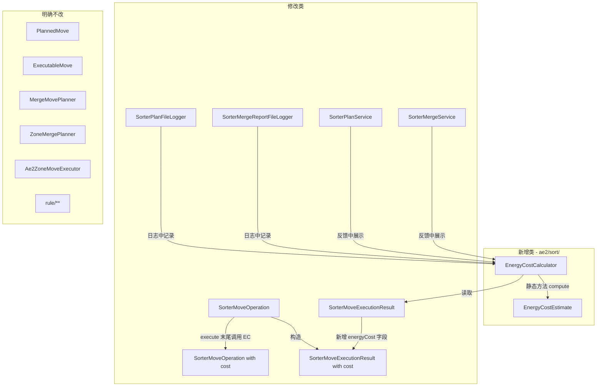

# 自动路由和 Merge 电量消耗模型 — 架构分析报告

> **分析目标**：`/sorter merge` 和 `/sorter me planAndMove` 添加基于搬运量、种类、距离的电量消耗
>
> **范围**：六层架构中的 AE2 集成层 (`ae2/`)，不反向污染 `rule/` 层
>
> **状态**：分析完成，待评审后进入编码

---

## 目录

1. [电量模型的定位](#1-电量模型的定位)
2. [计算公式建议](#2-计算公式建议)
3. [新增/修改的类](#3-新增修改的类)
4. [边界检查](#4-边界检查)
5. [与 AE2 能量系统的关系](#5-与-ae2-能量系统的关系)
6. [日志与反馈](#6-日志与反馈)
7. [实施路线图](#7-实施路线图)
8. [推荐方案 vs 不建议的方案](#8-推荐方案-vs-不建议的方案)

---

## 1. 电量模型的定位

### 1.1 分层归属

| 维度 | 决策 |
|------|------|
| **层** | AE2 集成层 (`ae2/sort/`) — 执行与诊断层 |
| **包** | `com.knightcode.appliedstoragesorter.ae2.sort` |
| **性质** | **执行后计量** (post-execution accounting)，**非规划时预估** |
| **语义** | **信息报告型**，非实际扣费型 |
| **可配置性** | 通过 `Config` 启用/禁用，默认关闭（向后兼容） |

### 1.2 为什么是"执行后计量"而非"规划时预估"

```
执行时计量的理由（推荐）：
  ✅ actual 数据可用：MoveResult 中有 extractedAmount / insertedAmount
  ✅ actual 距离可用：PlannedMove.source.drivePos ↔ destination.drivePos
  ✅ actual 种数可用：executionResult.moveResults 可去重统计 key
  ❌ 规划时只能得到"计划"数据，与真实执行有偏差（提取失败、回滚等）

规划时预估的劣势（不推荐）：
  ❌ MergeMovePlanner.plan() 中的 disposable insert-SIMULATE 已产生 I/O
  ❌ 如果在 plan 中加计费逻辑，会污染规划器的单一职责
  ❌ 计划值与实际值可能不一致（partial insert → rollback）
```

### 1.3 设计原则

```
原则 1：只计量，不扣费
  → 电量消耗作为信息指标输出给玩家，不作为"必须付费才能执行"的硬约束

原则 2：轻量设计，不引入"电力系统"
  → 不要新增电力缓存、充电队列、能量网络适配器等重型基础设施
  → 电量消耗计算是纯数值运算 + 字段附着

原则 3：向后兼容，默认关闭
  → 现有用户不受影响，电量消耗通过 Config 开关控制
  → 执行结果中电量字段为 Optional 或 nullable

原则 4：两条能力线共享同一套计量逻辑
  → merge 和 planAndMove 都在 SorterMoveOperation.execute() 执行
  → 电量计算作为执行结果的附加步骤，两条线自动受益
```

---

## 2. 计算公式建议

### 2.1 维度定义

| 维度 | 符号 | 数据来源 | 说明 |
|------|------|----------|------|
| 搬运量 | `A` | `MoveResult.insertedAmount` | 实际成功插入数，类型 `long` |
| 种类 | `T` | `moveResults` 去重后的 `PlannedMove.key` | 去重 key 计数，类型 `int` |
| 容器距离 | `D` | `PlannedMove.source.drivePos` → `destination.drivePos` | **曼哈顿距离**，类型 `int`（方块单位） |
| 执行计数 | `N` | `attemptedMoveCount` | 总尝试搬运次数，类型 `int` |

### 2.2 推荐公式（两套方案）

#### 方案 A：简洁线性（推荐用于 MVP）

```
EnergyCost = floor(N * α + A * β + T * γ + avgDist * δ)

其中：
  α = 基础搬运费            (default: 1.0)
  β = 单物品系数             (default: 0.01)
  γ = 每种系数              (default: 5.0)
  δ = 每格距离系数          (default: 0.1)
  avgDist = Σ(各 move 距离) / N
```

**特点**：
- 计算简单，整型运算无精度问题
- 每个维度系数独立，易理解易调参
- 适合 MVP 快速验证

#### 方案 B：对数饱和（推荐用于正式版）

```
EnergyCost = floor(
    α * N +
    β * log2(1 + A) +
    γ * log2(1 + T) +
    δ * log2(1 + avgDist)
)

其中：
  α = 基础搬运费            (default: 2.0)
  β = 数量饱和系数          (default: 20.0)
  γ = 种类饱和系数          (default: 30.0)
  δ = 距离饱和系数          (default: 15.0)
```

**特点**：
- `log2` 饱和防止极端值爆炸（如搬运 10^6 物品也不会天文数字）
- 物理含义清晰：搬运 1 组（64）和 10 组的边际成本递减
- 跨 10 个 drive vs 跨 2 个 drive 的差异更明显

### 2.3 推荐采用方案 B（对数饱和）

理由：
1. AE2 本身已有能量消耗机制，对数饱和与 AE2 的设计哲学一致（随规模增长成本递减边际）
2. 防止玩家通过一次 mega-merge 耗尽某种"虚构预算"
3. 数学优雅，`log2` 可用 `Long.SIZE - Long.numberOfLeadingZeros(n)` 高效计算，无浮点依赖

### 2.4 配置参数

通过 `Config.java` 新增：

```java
public static final ModConfigSpec.BooleanValue ENERGY_COST_ENABLED = BUILDER
    .comment("Enable energy cost estimation for sorter operations.")
    .define("energyCostEnabled", false);

public static final ModConfigSpec.DoubleValue ENERGY_COST_BASE_FEE = BUILDER
    .comment("Base energy cost per move operation.")
    .defineInRange("energyCostBaseFee", 2.0, 0.0, 100.0);

public static final ModConfigSpec.DoubleValue ENERGY_COST_AMOUNT_COEFF = BUILDER
    .comment("Energy cost coefficient per log2(1 + amount) of moved items.")
    .defineInRange("energyCostAmountCoeff", 20.0, 0.0, 1000.0);

public static final ModConfigSpec.DoubleValue ENERGY_COST_TYPE_COEFF = BUILDER
    .comment("Energy cost coefficient per log2(1 + distinct item types) involved.")
    .defineInRange("energyCostTypeCoeff", 30.0, 0.0, 1000.0);

public static final ModConfigSpec.DoubleValue ENERGY_COST_DISTANCE_COEFF = BUILDER
    .comment("Energy cost coefficient per log2(1 + average Manhattan distance) between drives.")
    .defineInRange("energyCostDistanceCoeff", 15.0, 0.0, 1000.0);
```

---

## 3. 新增/修改的类

### 3.1 新增类

#### `EnergyCostEstimate`

```java
// 包路径: ae2/sort/
// 职责: 承载电量消耗计算结果的轻量值对象
public record EnergyCostEstimate(
    long totalCost,         // 总消耗
    int moveCount,          // 搬运次数 (N)
    long movedAmount,       // 搬运量 (A)
    int distinctItemTypes,  // 种类 (T)
    int averageDistance,    // 平均距离 (avgDist)
    CostBreakdown breakdown // 明细
) {
    public record CostBreakdown(
        long baseCost,
        long amountCost,
        long typeCost,
        long distanceCost
    ) {}
}
```

#### `EnergyCostCalculator`

```java
// 包路径: ae2/sort/
// 职责: 无状态工具类，从 SorterMoveExecutionResult 计算电量消耗
// 设计: 纯静态方法，无实例状态
// 依赖: 仅依赖 PlannedMove / DriveCellReference / SorterMoveExecutionResult
public final class EnergyCostCalculator {
    // 核心方法
    public static EnergyCostEstimate estimate(SorterMoveExecutionResult result);

    // 内部工具: log2(1 + n) 高效实现
    private static long log2Ceil(long n);

    // 内部工具: 曼哈顿距离
    private static int manhattanDistance(BlockPos a, BlockPos b);
}
```

### 3.2 修改类

#### `SorterMoveExecutionResult` — 新增 `EnergyCostEstimate` 字段

```java
public record SorterMoveExecutionResult(
    int attemptedMoveCount,
    int completedMoveCount,
    int failedMoveCount,
    long requestedAmount,
    long movedAmount,
    List<MoveResult> moveResults,
    @Nullable EnergyCostEstimate energyCost  // ← 新增，nullable 向后兼容
) {
    // 新增: withEnergyCost 工厂方法用于执行后附加
    public SorterMoveExecutionResult withEnergyCost(EnergyCostEstimate energyCost) {
        return new SorterMoveExecutionResult(
            attemptedMoveCount, completedMoveCount, failedMoveCount,
            requestedAmount, movedAmount, moveResults, energyCost);
    }
}
```

**影响分析**：
- `SorterMoveOperation.execute()` 内部调用 `EnergyCostCalculator.estimate(this)` + `withEnergyCost()` 附加
- 修改 `SorterMoveOperation.of()` 和 `SorterMoveOperation.empty()` 以传递新字段
- 所有现有构造点需要双版本适配（有/无 energyCost）

#### `SorterMergeService.execute()` — 新增电量反馈

在 `SorterMergeService.java` 第 69-72 行的反馈列表中增加配置开关 + 电量展示。

#### `SorterPlanService` — 新增电量反馈

在 `SorterPlanService.java` 第 97-101 行后的反馈列表中增加电量展示。

#### `SorterMergeReportFileLogger` — 日志中记录电量

在 merge 日志的 `[executed_moves]` 后追加 `[energy_cost]` 节。

#### `SorterPlanFileLogger` — 日志中记录电量

在 plan-and-move 日志中追加电量消耗明细。

### 3.3 建议不修改的类

| 类 | 理由 |
|----|------|
| `PlannedMove` | record 职责是搬运计划，不应背负计费数据 |
| `ExecutableMove` | 运行时内部类，保持轻量 |
| `MergeMovePlanner` | 规划器只负责 plan，不负责计费 |
| `ZoneMergePlanner` | 同理，不污染规划职责 |
| `Ae2ZoneMoveExecutor` | 薄编排层，不需要感知电量 |
| `rule/**` 任何类 | 架构边界禁止 |

### 3.4 改动全景图



---

## 4. 边界检查

### 4.1 层依赖检查

| 新类 | 所在包 | 依赖的第三方 | 是否违规 |
|------|--------|-------------|----------|
| `EnergyCostEstimate` | `ae2/sort/` | 无（纯 record） | ✅ 正常 |
| `EnergyCostCalculator` | `ae2/sort/` | `PlannedMove`, `DriveCellReference`, `SorterMoveExecutionResult`, `BlockPos` | ✅ 正常（`ae2/` 内引用和 Minecraft 类是 AE2 集成层合法依赖） |

### 4.2 能力线隔离检查

```
Merge 能力线: MergeMovePlanner → SorterMoveOperation → SorterMoveExecutionResult
Zone 能力线: Ae2ZoneMoveExecutor → ZoneMergePlanner → SorterMoveOperation → SorterMoveExecutionResult

电量计算挂在 SorterMoveOperation.execute() → SorterMoveExecutionResult 上
两条能力线共享执行引擎，自动受益
```

✅ **不破坏能力线隔离**：电量计算不要求 merge 或 zone 路径感知对方的存在。

### 4.3 规则层污染检查

```
❌ rule/** 不导入任何新类
✅ EnergyCostCalculator 无需访问 RoutingProfile/ItemFilter/RuleRule
✅ EnergyCostEstimate 是纯 ae2/sort/ 类型
```

### 4.4 `network/` 包检查

```
✅ 不需要新增网络包
✅ 电量消耗仅存在于服务端执行结果中，通过聊天反馈展示给玩家
```

### 4.5 Logger 基础设施检查

```
✅ EnergyCostCalculator 不负责日志输出
✅ 日志中记录电量是 SorterMergeReportFileLogger / SorterPlanFileLogger 的职责
✅ 符合 ADR-004 (Logger 作为基础设施层)
```

---

## 5. 与 AE2 能量系统的关系

### 5.1 当前设计：信息报告，非实际扣费

| 考量 | 说明 |
|------|------|
| **是否从 AE2 网络抽能** | ❌ **不** — 当前阶段是纯信息指标 |
| **是否复用 `IEnergySource.extractAEPower()`** | ❌ 不 — 不实际消耗 AE2 能量 |
| **是否展示给玩家** | ✅ 是 — 通过聊天栏反馈和日志文件展示 |

### 5.2 为什么不做实际扣费

1. **复杂度风险**：AE2 的能量系统涉及 `IEnergySource`、`EnergyService`、`IActionSource` 等多层 API，且在不同 AE2 版本中行为有差异。引入实际扣费意味着需要处理能量不足时的回滚逻辑、排队逻辑，远超"轻量设计"的边界。

2. **架构清洁**：`SorterMoveOperation` 当前是纯 extract→insert→rollback 逻辑，引入能量扣费需要额外的 `IActionSource` 参数传递和在 `execute()` 循环中注入能量检查，破坏其单一职责。

3. **用户体验**：强制扣费可能导致玩家因 AE2 能量不足而无法执行 merge，这是反直觉的（整理存储不应消耗 ME 能量）。信息展示让玩家了解操作"成本"，但不强制。

### 5.3 未来扩展预留

如果未来需要降为实际扣费，设计上预留以下入口：

```java
// EnergyCostCalculator 的 estimate 结果可直接转换为能量值
// 未来可在 SorterMoveOperation.execute() 的循环中添加:
//
// IEnergySource energySource = grid.getEnergyService();
// energySource.extractAEPower(energyCost, Actionable.MODULATE, IActionSource.ofMachine(...));
//
// 但当前不实现，仅作为已知扩展点记录
```

> **决策**：本次实现**不做**实际扣费，仅输出信息指标。实际扣费的决策推迟到有明确需求时再做 ADR。

---

## 6. 日志与反馈

### 6.1 聊天栏反馈

merge 执行后新增一行：

```
energyCost=185               （新行）
plannedMergeCount=12
mergedAmount=896/1024
mergeReport=logs/appliedinsight/merge-xxx.log
```

planAndMove 执行后新增一行：

```
move.energyCost=185          （新行）
move.attempted=12
move.completed=10
move.failed=2
...
```

### 6.2 Merge 日志格式

在现有 merge 日志追加 `[energy_cost]` 节：

```ini
[energy_cost]
enabled=true
total_cost=185
move_count=12
moved_amount=896
distinct_item_types=7
average_distance=24
cost_breakdown: base=24|amount=62|type=76|distance=23
```

### 6.3 PlanAndMove 日志格式

在 `[zone_move_debug]` 节后追加 `[energy_cost]` 节。

### 6.4 日志记录位置

| 日志类 | 修改位置 | 内容 |
|--------|----------|------|
| `SorterMergeReportFileLogger.logMergeReport()` | `buildContent()` 末尾追加 | 合并路径的电量消耗 |
| `SorterPlanFileLogger.logPlanAndMove()` | 追加在详细结果后 | zone 路径的电量消耗 |

---

## 7. 实施路线图

### 阶段 MVP（最小可行）

```
Step 1: 新增 EnergyCostEstimate record
  → 纯值对象，无业务逻辑
  → 单元测试: 构造与 toString

Step 2: 新增 EnergyCostCalculator
  → 静态方法 estimate(SorterMoveExecutionResult)
  → 实现对数饱和公式 + 曼哈顿距离
  → 单元测试: 多种输入组合验证

Step 3: 修改 SorterMoveExecutionResult 新增 energyCost 字段
  → nullable，向后兼容
  → 修改 SorterMoveOperation.execute() 在返回前调用 calculate
  → 修改 SorterMoveOperation.of() / empty() 传递值
  → 回归测试: 确保现有行为不受影响

Step 4: 修改 SorterMergeService + SorterPlanService 展示电量
  → 在反馈列表中添加 energyCost 行
  → 受 Config.ENERGY_COST_ENABLED 控制

Step 5: 修改日志 Logger 追加电量记录
  → SorterMergeReportFileLogger
  → SorterPlanFileLogger
```

### 阶段 2（增强）

```
Step 6: Config 配置参数调优（系数默认值）
Step 7: 添加 /sorter me energyCost 只读命令展示模型参数
Step 8: 文档说明更新（类职责文档 + 整体逻辑）
```

---

## 8. 推荐方案 vs 不建议的方案

### ✅ 推荐方案

| 维度 | 推荐方案 | 理由 |
|------|----------|------|
| **定位** | 执行后计量 + 信息报告 | 不引入强制扣费的复杂度 |
| **公式** | 对数饱和 (方案 B) | 防止极端值爆炸，与 AE2 设计哲学一致 |
| **新类** | `EnergyCostEstimate` + `EnergyCostCalculator` | 清晰的职责分离 |
| **修改** | 只改 `SorterMoveExecutionResult` 和上层展示/日志 | 最小改动范围 |
| **配置** | 默认关闭 (`energyCostEnabled = false`) | 向后兼容 |

### ❌ 不建议的方案

| 方案 | 不建议理由 |
|------|------------|
| **在 `MergeMovePlanner.plan()` 中计算** | 污染规划器职责；规划时只能"预估"，不是实际值 |
| **在 `SorterMoveOperation.execute()` 中实时扣 AE2 能量** | 引入强制依赖 + 能量不足回滚复杂度；当前无此需求 |
| **引入完整的"电力系统"大框架** | 过度设计；需求只是"展示一个消耗数字" |
| **使用线性公式不饱和** | 一次搬运 10^6 物品会产生天文数字；不符合直觉 |
| **修改 `PlannedMove` 或 `ExecutableMove` 增加电量字段** | 这些类应保持轻量，电量是执行结果的聚合属性，不逐 move 记录 |
| **将电量计算放在 `rule/` 层** | 违反 ADR-002（规则层不能有运行时依赖，需要 `BlockPos` 距离计算） |

---

## 附录 A：数据流变化对比

### 修改前

```
SorterMoveOperation.execute()
  → extract → insert → rollback (循环)
  → new SorterMoveExecutionResult(...)
  → return
```

### 修改后

```
SorterMoveOperation.execute()
  → extract → insert → rollback (循环)
  → result = new SorterMoveExecutionResult(...)
  → if (Config.ENERGY_COST_ENABLED)
      energyCost = EnergyCostCalculator.estimate(result)
      result = result.withEnergyCost(energyCost)
  → return result
```

## 附录 B：曼哈顿距离计算

```java
// DriveCellReference 持有 BlockPos drivePos
// 距离 = |x1-x2| + |y1-y2| + |z1-z2|
int distance = Math.abs(source.drivePos().getX() - dest.drivePos().getX())
             + Math.abs(source.drivePos().getY() - dest.drivePos().getY())
             + Math.abs(source.drivePos().getZ() - dest.drivePos().getZ());
```

注意：如果 source 有 `attachedStoragePos`（ex_drive 场景），应优先使用 `attachedStoragePos` 作为距离计算锚点，因为该位置才是存储实际所在的坐标。但为保持简单，MVP 阶段统一使用 `drivePos`。

---

> **报告版本**: v1.0
> **分析者**: 架构分析模式
> **关联文档**: `ARCHITECTURE_REFERENCE.md` | `整体逻辑.md` | `Config.java`
