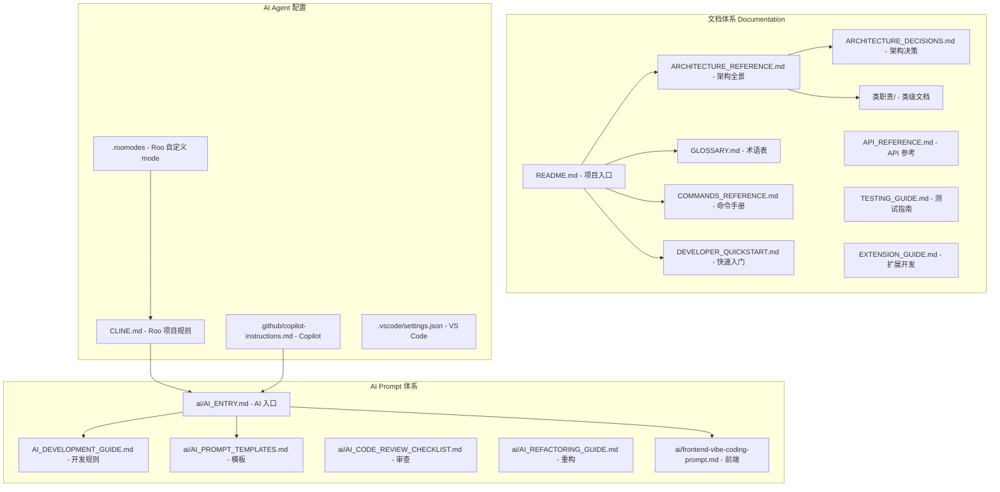

# Applied Storage Sorter — 文档 / Prompt / Agent 系统性完善计划

> 基于 [`plans/项目理解总结.md`](plans/项目理解总结.md) 的项目理解，制定本完善计划。
> 工具链：Roo + DeepSeek + VS Code + GitHub Copilot
> 目标：让项目文档体系、AI 协作 prompt、AI agent 配置三者形成完整闭环，降低新开发者和 AI 协作者的接入成本。

---

## 一、现状评估

### 已有文档（质量较高）
| 文档 | 状态 | 评价 |
|------|------|------|
| `README.md` | ✅ 存在 | 内容详实但缺少徽章、快速开始、命令速查 |
| `docs/GLOSSARY.md` | ✅ 存在 | 术语覆盖全面，可补充交叉引用 |
| `docs/ARCHITECTURE_REFERENCE.md` | ✅ 存在 | 架构全景清晰，可补充更多图表 |
| `docs/整体逻辑.md` | ✅ 存在 | 主骨架清晰 |
| `docs/类职责总览.md` | ✅ 存在 | 审查结论完整 |
| `docs/类职责/索引.md` | ✅ 存在 | 103 个类索引 |
| `docs/类职责/` (103 个文档) | ✅ 存在 | 覆盖率高，部分文档格式需统一 |
| `docs/AI_DEVELOPMENT_GUIDE.md` | ✅ 存在 | 规则明确，可强化代码生成规范 |
| `docs/ai/AI_ENTRY.md` | ✅ 存在 | 入口完整，可优化导航结构 |
| `docs/ai/frontend-vibe-coding-prompt.md` | ✅ 存在 | 前端 prompt 完整 |
| `docs/下一步计划.md` | ✅ 存在 | 阶段方向明确 |
| `docs/DEVELOPER_GUIDE.md` | ✅ 存在 | 环境搭建完整，可补充更多场景 |
| `docs/前端对接说明.md` | ✅ 存在 | 边界清晰 |
| `docs/日志与JSON字段契约.md` | ✅ 存在 | 字段契约完整 |
| `docs/dashboard的设计哲学.md` | ✅ 存在 | 产品哲学清晰 |
| `docs/存储节点语义层.md` | ✅ 存在 | 但内容实际是 AI 开发指南的副本（需修复） |
| `docs/Analyzer-阶段定位草案.md` | ✅ 存在 | 定位清晰 |
| `docs/RuntimeTopology-设计草案.md` | ✅ 存在 | 设计原则完整 |
| `docs/后端JSON完善指南.md` | ✅ 存在 | 后端现状说明 |
| `docs/前端对接契约-需求-约束.md` | ✅ 存在 | 前端契约 |

### 缺失的文档
| 文档 | 优先级 | 理由 |
|------|--------|------|
| `docs/API_REFERENCE.md` | 🔴 高 | 开发者需要完整的 API 参考 |
| `docs/COMMANDS_REFERENCE.md` | 🔴 高 | 所有命令的完整参考手册 |
| `docs/ARCHITECTURE_DECISIONS.md` (ADR) | 🟡 中 | 记录关键架构决策及其理由 |
| `docs/TESTING_GUIDE.md` | 🟡 中 | 测试策略和编写指南 |
| `docs/EXTENSION_GUIDE.md` | 🟡 中 | 扩展开发指南 |
| `docs/ai/AI_PROMPT_TEMPLATES.md` | 🟡 中 | AI 协作提示词模板 |
| `docs/ai/AI_CODE_REVIEW_CHECKLIST.md` | 🟢 低 | AI 代码审查清单 |
| `docs/ai/AI_REFACTORING_GUIDE.md` | 🟢 低 | AI 重构指南 |

### 缺失的 AI Agent 配置
| 文件 | 优先级 | 理由 |
|------|--------|------|
| `.roomodes` | 🔴 高 | Roo 自定义 mode 定义 |
| `CLINE.md` | 🔴 高 | Roo 项目级规则（自动加载） |
| `.github/copilot-instructions.md` | 🟡 中 | GitHub Copilot 指令 |
| `.vscode/settings.json` | 🟢 低 | VS Code 推荐配置 |

---

## 二、整体架构

---

## 三、分阶段执行计划

### 阶段一：文档体系完善（核心工作量）

#### 1.1 增强 `README.md`
**目标**：让 README 成为项目的第一入口，5 分钟内让新开发者理解项目全貌。

**具体改动**：
- 增加项目徽章行（Minecraft 版本、NeoForge 版本、AE2 版本、Java 版本）
- 增加"快速开始"章节（3 步从零到运行）
- 增加"命令速查表"（所有命令及其语义）
- 增加"架构概览"Mermaid 图（六层架构）
- 增加"文档导航"章节（按角色推荐阅读路径）
- 增加"贡献"章节链接到 DEVELOPER_GUIDE.md

#### 1.2 创建 `docs/API_REFERENCE.md`
**目标**：提供完整的后端 API 参考，供集成开发者查阅。

**内容**：
- 命令 API（所有 `/sorter` 命令的签名、参数、返回、示例）
- JSON 契约 API（me-dump、storage-analysis、routing-profile 的完整字段说明）
- 扩展点 API（如何实现自定义 Filter、Analyzer、ProfileGenerator）
- 事件 API（NeoForge 事件监听）
- 网络包 API（SorterCommandPayload、SorterAnalysisPayload 等）

#### 1.3 创建 `docs/DEVELOPER_QUICKSTART.md`
**目标**：让新开发者在 15 分钟内完成环境搭建并运行第一个命令。

**内容**：
- 环境要求（Java 21、Git、IDE）
- 克隆与构建
- 运行 Minecraft 客户端
- 执行第一个 `/sorter me dump`
- 查看输出产物
- 运行离线分析任务
- 常见问题排查

#### 1.4 创建 `docs/ARCHITECTURE_DECISIONS.md` (ADR)
**目标**：记录关键架构决策及其上下文，避免后续重复讨论。

**内容**（每个 ADR 包含：标题、状态、上下文、决策、后果）：
- ADR-001: 六层架构分层
- ADR-002: 规则层纯模型隔离（无 Minecraft/AE2 依赖）
- ADR-003: 胖 RuntimeTopology 原则
- ADR-004: Logger 即基础设施
- ADR-005: DAV 不是架构中心
- ADR-006: 两条能力线分离（merge vs zone governance）
- ADR-007: 开箱即用优先（dashboard 设计哲学）
- ADR-008: Analyzer 最小职责原则

#### 1.5 创建 `docs/TESTING_GUIDE.md`
**目标**：建立测试规范和指南。

**内容**：
- 测试分层（单元测试、集成测试、离线分析测试）
- 单元测试编写规范（JUnit 5 + 断言风格）
- 离线分析测试（Gradle tasks 使用）
- 测试数据管理（testfiles 目录）
- 运行测试命令
- 测试覆盖率目标

#### 1.6 创建 `docs/COMMANDS_REFERENCE.md`
**目标**：所有命令的完整参考手册。

**内容**（每个命令包含：语法、权限、参数、示例、输出示例）：
- `/sorter merge`（preview / execute）
- `/sorter me dump`
- `/sorter me storageDump`
- `/sorter me bindProfile`
- `/sorter me showProfile`
- `/sorter me plan`
- `/sorter me planAndMove`

#### 1.7 创建 `docs/EXTENSION_GUIDE.md`
**目标**：指导开发者如何扩展项目功能。

**内容**：
- 新增一个命令的完整步骤（含代码示例）
- 新增一个 Filter 字段的步骤
- 新增一个 Analyzer 的步骤
- 新增一个 ProfileGenerator 的步骤
- 新增一个 Logger 的步骤
- 修改执行逻辑的步骤
- 修改 JSON 契约的步骤

#### 1.8 优化 `docs/GLOSSARY.md`
**目标**：补充缺失术语，增强可导航性。

**具体改动**：
- 补充缺失术语（`SorterCommandBlock`、`CellCapacityInspector`、`NbtPathExtractor`、`ReportFileSupport` 等）
- 每个术语增加"参见"交叉引用
- 增加中英文首字母索引
- 统一术语定义的格式模板

#### 1.9 优化 `docs/ARCHITECTURE_REFERENCE.md`
**目标**：补充更多可视化图表，增强可理解性。

**具体改动**：
- 补充完整的类关系图（Mermaid classDiagram）
- 补充三条能力路径的时序图（已部分存在）
- 补充数据流图（从命令输入到日志输出的完整数据流）
- 补充包依赖关系图
- 补充分层统计的饼图/柱状图

#### 1.10 优化 `docs/类职责/` 文档
**目标**：确保所有 Java 类型都有对应的类职责文档，格式统一。

**具体改动**：
- 补充缺失的类职责文档（检查索引中 103 个类 vs 实际源码）
- 统一文档格式模板（定位、关键方法、依赖关系、关键边界）
- 确保每个文档包含正确的源码链接
- 补充 `ae2/analysis/`、`network/`、`client/` 等包下缺失的文档

---

### 阶段二：AI 协作 Prompt 优化

#### 2.1 重构 `docs/ai/AI_ENTRY.md`
**目标**：让 AI 协作者在 1 分钟内找到所需信息。

**具体改动**：
- 增加"快速导航"章节（按任务类型索引）
- 增加"问题分类"章节（常见问题 → 对应文档）
- 优化阅读顺序建议（按角色：新开发者 / 贡献者 / 架构师）
- 补充最新增量信息（CellCapacityInspector、NbtPathExtractor 等）
- 增加"常见修改场景"的快速链接

#### 2.2 重构 `docs/AI_DEVELOPMENT_GUIDE.md`
**目标**：强化规则体系，增加代码生成规范。

**具体改动**：
- 增加"代码生成规范"章节（命名约定、包结构、日志风格）
- 增加"AI 不应做的事"清单（防止过度抽象、跨层依赖等）
- 增加"修改代码前的检查清单"（强化现有清单）
- 增加"代码生成示例"（好的 vs 不好的代码对比）
- 增加"文档同步规则"（修改代码后必须同步哪些文档）

#### 2.3 创建 `docs/ai/AI_PROMPT_TEMPLATES.md`
**目标**：提供常见任务的提示词模板，提高 AI 协作效率。

**内容**（每个模板包含：任务描述、上下文要求、输出格式）：
- 新增命令模板
- 修改执行逻辑模板
- 修改 JSON 契约模板
- 新增 Filter 字段模板
- 代码审查模板
- 重构建议模板
- Bug 修复模板

#### 2.4 创建 `docs/ai/AI_CODE_REVIEW_CHECKLIST.md`
**目标**：AI 代码审查的标准化检查清单。

**内容**：
- 架构边界检查（rule 层无 AE2 依赖等）
- 命名规范检查
- 日志规范检查
- 文档同步检查
- 测试覆盖检查
- 向后兼容检查

#### 2.5 创建 `docs/ai/AI_REFACTORING_GUIDE.md`
**目标**：指导 AI 安全地进行代码重构。

**内容**：
- 重构前的准备工作（阅读文档、理解边界）
- 安全重构步骤（小步提交、编译验证）
- 重构类型与对应策略（重命名、提取方法、移动类等）
- 重构后的验证清单
- 文档同步要求

#### 2.6 优化 `docs/ai/frontend-vibe-coding-prompt.md`
**目标**：同步最新后端契约变更。

**具体改动**：
- 检查并同步最新的 me-dump JSON 字段变更
- 检查并同步最新的 storage-analysis JSON 字段变更
- 检查并同步最新的 routing-profile JSON 字段变更
- 更新 TypeScript 类型定义（如有新增字段）

---

### 阶段三：AI Agent 配置创建

#### 3.1 创建 `.roomodes` — Roo 自定义 Mode 定义
**目标**：为项目定义专用的 Roo mode，让 Roo 在对应 mode 下自动理解项目上下文。

**内容**（Roo 的 `.roomodes` 格式，定义多个 mode）：
- **core-dev mode**：项目核心开发 mode，包含架构边界、代码规范、构建命令
- **docs mode**：文档编写 mode，包含文档规范、交叉引用规则
- **analysis mode**：离线分析 mode，包含分析器使用指南
- **review mode**：代码审查 mode，包含审查清单

每个 mode 包含：
- `slug`：mode 标识
- `name`：显示名称
- `roleDefinition`：角色定义
- `customInstructions`：项目特定的指令（引用 CLINE.md 和关键文档）

#### 3.2 创建 `CLINE.md` — Roo 项目级规则
**目标**：Roo 在项目中自动加载的规则文件，确保每次对话都理解项目上下文。

**内容**：
- 项目简介与两条能力线
- 技术栈（Java 21、NeoForge、AE2、Lombok、SLF4J）
- 架构边界（六层架构、硬规则）
- 代码规范（命名约定、日志规范、包访问原则）
- 关键文件索引（入口、核心类、文档）
- 命令速查（构建、测试、运行、离线分析）
- 文档同步规则（修改代码后必须同步哪些文档）
- 常见陷阱（DriveMachineAccessor、rule 层隔离等）
- 任务分解指南（如何将复杂任务拆解为可执行步骤）

#### 3.3 创建 `.github/copilot-instructions.md`
**目标**：让 GitHub Copilot 提供上下文感知的代码建议。

**内容**：
- 语言与框架（Java 21、NeoForge、AE2 API）
- 项目结构概述
- 架构约束（rule 层无 Minecraft 依赖等）
- 命名约定
- 日志规范（SLF4J + Lombok @Slf4j）
- 测试框架（JUnit 5）

#### 3.4 创建 `.vscode/settings.json` 推荐配置
**目标**：统一 VS Code 开发环境配置。

**内容**：
- Java 格式化配置
- Lombok 注解处理
- Gradle 构建任务
- 推荐扩展列表
- 调试配置

---

### 阶段四：文档质量审核与交叉链接

#### 4.1 审核交叉引用链接
- 检查所有文档中的相对链接是否正确
- 修复断链和错误引用
- 确保 `docs/类职责/索引.md` 中的链接全部有效

#### 4.2 统一文档格式
- 统一标题层级（# → ## → ###）
- 统一术语使用（中英文一致性）
- 统一代码块语言标注
- 统一 Mermaid 图风格

#### 4.3 确保类职责文档全覆盖
- 对比 `docs/类职责/索引.md` 与实际源码文件列表
- 补充缺失的类职责文档
- 确保每个文档包含：定位、关键方法、依赖关系、关键边界

#### 4.4 验证文档与源码一致性
- 检查类职责文档中的方法签名是否与源码一致
- 检查架构文档中的描述是否与当前实现一致
- 检查 JSON 契约文档是否与 schema 文件一致

---

## 四、执行顺序建议

```mermaid
graph LR
    subgraph "阶段一: 文档体系"
        A1[1.1 README] --> A2[1.2 API_REFERENCE]
        A2 --> A3[1.3 DEVELOPER_QUICKSTART]
        A3 --> A4[1.4 ARCHITECTURE_DECISIONS]
        A4 --> A5[1.5 TESTING_GUIDE]
        A5 --> A6[1.6 COMMANDS_REFERENCE]
        A6 --> A7[1.7 EXTENSION_GUIDE]
        A7 --> A8[1.8 GLOSSARY 优化]
        A8 --> A9[1.9 ARCHITECTURE_REFERENCE 优化]
        A9 --> A10[1.10 类职责文档优化]
    end

    subgraph "阶段二: AI Prompt"
        B1[2.1 AI_ENTRY 重构] --> B2[2.2 AI_DEVELOPMENT_GUIDE 重构]
        B2 --> B3[2.3 PROMPT_TEMPLATES]
        B3 --> B4[2.4 CODE_REVIEW_CHECKLIST]
        B4 --> B5[2.5 REFACTORING_GUIDE]
        B5 --> B6[2.6 前端 prompt 同步]
    end

    subgraph "阶段三: Agent 配置"
        C1[3.1 .roomodes] --> C2[3.2 CLINE.md]
        C2 --> C3[3.3 copilot-instructions]
        C3 --> C4[3.4 VS Code settings]
    end

    subgraph "阶段四: 质量审核"
        D1[4.1 链接审核] --> D2[4.2 格式统一]
        D2 --> D3[4.3 全覆盖检查]
        D3 --> D4[4.4 一致性验证]
    end

    A10 --> B1
    B6 --> C1
    C4 --> D1
```

**推荐执行顺序**：
1. 先做阶段一（文档体系），这是基础
2. 再做阶段二（AI Prompt），基于完善的文档体系
3. 然后做阶段三（Agent 配置），引用文档和 prompt
4. 最后做阶段四（质量审核），全局收口

---

## 五、文件清单总览

### 新增文件（12 个）
| 文件 | 阶段 | 优先级 |
|------|------|--------|
| `docs/API_REFERENCE.md` | 一 | 🔴 高 |
| `docs/DEVELOPER_QUICKSTART.md` | 一 | 🔴 高 |
| `docs/ARCHITECTURE_DECISIONS.md` | 一 | 🟡 中 |
| `docs/TESTING_GUIDE.md` | 一 | 🟡 中 |
| `docs/COMMANDS_REFERENCE.md` | 一 | 🔴 高 |
| `docs/EXTENSION_GUIDE.md` | 一 | 🟡 中 |
| `docs/ai/AI_PROMPT_TEMPLATES.md` | 二 | 🟡 中 |
| `docs/ai/AI_CODE_REVIEW_CHECKLIST.md` | 二 | 🟢 低 |
| `docs/ai/AI_REFACTORING_GUIDE.md` | 二 | 🟢 低 |
| `.roomodes` | 三 | 🔴 高 |
| `CLINE.md` | 三 | 🔴 高 |
| `.github/copilot-instructions.md` | 三 | 🟡 中 |

### 修改文件（10 个）
| 文件 | 阶段 | 优先级 |
|------|------|--------|
| `README.md` | 一 | 🔴 高 |
| `docs/GLOSSARY.md` | 一 | 🟡 中 |
| `docs/ARCHITECTURE_REFERENCE.md` | 一 | 🟡 中 |
| `docs/类职责/` (多个文档) | 一 | 🟡 中 |
| `docs/ai/AI_ENTRY.md` | 二 | 🔴 高 |
| `docs/AI_DEVELOPMENT_GUIDE.md` | 二 | 🔴 高 |
| `docs/ai/frontend-vibe-coding-prompt.md` | 二 | 🟡 中 |
| `.vscode/settings.json` | 三 | 🟢 低 |
| `docs/类职责/索引.md` | 四 | 🟡 中 |
| `docs/类职责总览.md` | 四 | 🟢 低 |

---

## 六、验收标准

### 阶段一完成标准
- [ ] README 可在 5 分钟内让新开发者理解项目全貌
- [ ] API_REFERENCE 覆盖所有命令和 JSON 契约
- [ ] DEVELOPER_QUICKSTART 可在 15 分钟内完成环境搭建
- [ ] ARCHITECTURE_DECISIONS 记录至少 8 个关键决策
- [ ] TESTING_GUIDE 覆盖所有测试类型
- [ ] COMMANDS_REFERENCE 覆盖所有 7 个命令
- [ ] EXTENSION_GUIDE 覆盖 5 种扩展场景
- [ ] GLOSSARY 覆盖所有关键术语
- [ ] ARCHITECTURE_REFERENCE 包含完整的类图和时序图
- [ ] 所有 Java 类型都有对应的类职责文档

### 阶段二完成标准
- [ ] AI_ENTRY 可在 1 分钟内定位到所需信息
- [ ] AI_DEVELOPMENT_GUIDE 包含完整的代码生成规范
- [ ] AI_PROMPT_TEMPLATES 覆盖 7 种常见任务
- [ ] AI_CODE_REVIEW_CHECKLIST 覆盖所有检查项
- [ ] AI_REFACTORING_GUIDE 覆盖所有重构类型
- [ ] 前端 prompt 与最新后端契约一致

### 阶段三完成标准
- [ ] Roo 加载 `.roomodes` 后能正确切换 mode
- [ ] Roo 自动加载 `CLINE.md` 规则
- [ ] GitHub Copilot 能提供上下文感知的代码建议
- [ ] VS Code 工作区配置一致

### 阶段四完成标准
- [ ] 所有文档交叉引用链接正确
- [ ] 文档格式和术语使用一致
- [ ] 类职责文档覆盖率达到 100%
- [ ] 文档描述与源码实现一致
