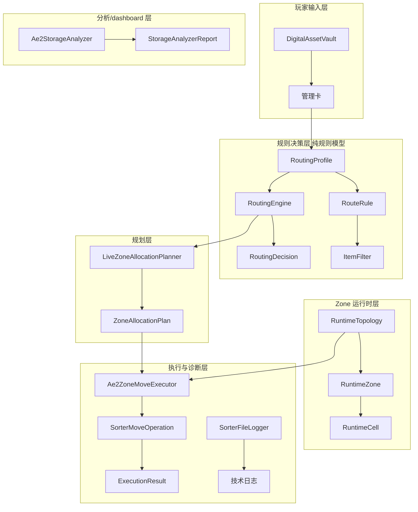

# Applied Energistics: Insight — 项目理解总结

> **应用能源：洞察** · Mod ID `appliedinsight` · 0.9.0-beta

## 一、项目概览

**应用能源：洞察**（Applied Energistics: Insight）是一个 Minecraft NeoForge 模组（MC 1.21.1），为 AE2 提供存储观测、整理与扩展能力。

### 技术栈
| 维度 | 内容 |
|------|------|
| Minecraft | 1.21.1 |
| NeoForge | 21.1.224 |
| AE2 | 19.2.17 |
| Java | 21 |
| 构建工具 | Gradle 9.2.1 (NeoGradle) |
| 映射 | Parchment 2024.11.17 |
| 代码风格 | Lombok (`@Slf4j`), SLF4J |

---

## 二、两条核心能力线

```
┌─────────────────────────────────────────────────┐
│              Applied Energistics: Insight              │
├──────────────────────┬──────────────────────────┤
│  自动整理 (Merge)     │  自动搬运 (Zone治理)      │
│                      │                          │
│  /sorter merge       │  /sorter me bindProfile  │
│  同类归并             │  /sorter me plan         │
│  无配置即可用         │  /sorter me planAndMove  │
│                      │  需 DAV + 管理卡配置      │
└──────────────────────┴──────────────────────────┘
```

### 1. 快速合并路径 (`/sorter merge`)
- 低复杂度场景入口，无需配置 profile/zone/DAV
- 核心类：`MergeMovePlanner` → `SorterMoveOperation` → `SorterMergeReportFileLogger`
- 输出 merge 前后对比报告

### 2. Zone 治理主线 (`/sorter me ...`)
完整链路：`bindProfile → plan → planAndMove`
- `Ae2ControllerTargetResolver` 找到 grid
- `NetworkProfileBindingStore` 找到绑定的 RoutingProfile
- `LiveZoneAllocationPlanner` 生成 live plan
- `RuntimeZoneRegistryBuilder` 构建 RuntimeTopology
- `Ae2ZoneMoveExecutor` 执行 zone move
- `SorterPlanFileLogger` 输出详细日志

### 3. 宏观观测路径 (`/sorter me storageDump`)
- `SorterStorageAnalysisService` → `Ae2StorageAnalyzer` → dashboard snapshot
- 定位：宏观调控的主界面基础，不是执行链路

---

## 三、六层架构



### 各层职责与关键边界

| 层 | 核心类数 | 关键边界 |
|----|---------|---------|
| **规则决策层** (`rule/`) | 31 类 | **纯规则模型，无 Minecraft/AE2 运行时依赖** — 最重要的架构边界 |
| **AE2 集成层** (`ae2/`) | 26 类 | 运行时、扫描、执行，不反向依赖 application 层 |
| **应用服务层** (`application/`) | 10 类 | 用例编排，不包含持久化实现 |
| **规划模型层** (`plan/`) | 3 类 | 产出计划但不承担执行职责 |
| **离线分析层** (`analysis/`) | 5 类 | 可离线运行，不污染在线命令链 |
| **日志基础设施层** (`logging/`) | 4 类 | 不参与业务决策 |
| **注册装配层** (`registry/`) | 7 类 | 模组注册 |
| **玩家输入层** (block/item/menu/client) | 8 类 | DAV 是管理入口，不是架构中心 |

---

## 四、关键架构原则

1. **规则层不碰运行时** — `RoutingEngine` 不依赖 Minecraft/AE2 类
2. **运行时层不重做规则层** — `RuntimeZone` 只做 zone→cell 映射
3. **DAV 不承担后端规划** — DAV 负责表达意图，管理卡携带 zone 数据
4. **分析层独立于游戏主流程** — `analysis/` 和 `profilegen/` 可离线运行
5. **Logger 即基础设施** — 核心类不应为日志需求扭曲自身职责
6. **胖 topology 原则** — `RuntimeTopology` 允许适度偏胖，换取其他对象变薄

---

## 五、当前技术债与阶段方向

### 已确认的技术债
1. `DriveMachineAccessor` — 使用反射和 block id 白名单适配 drive-like 机器
2. `MergeMovePlanner` — 快速 merge 路径，与 zone 主线并存但定位明确
3. `SorterMergeService` — 低复杂度场景保留入口

### 当前阶段方向（来自 `docs/下一步计划.md`）
> **拓扑已经干净，接下来先把 logger 做强。**

重点：
1. 统一技术日志方案（SLF4J + Lombok `@Slf4j`）
2. 强化报告型 logger（plan/merge/dump/analysis）
3. 明确 logger 不反向定义核心模型

---

## 六、命令系统

| 命令 | 后端服务 | 语义 |
|------|---------|------|
| `/sorter merge` | `SorterMergeService` | 快速合并同类物品 |
| `/sorter me dump` | `SorterDumpService` | 导出 cell 分布 JSON |
| `/sorter me storageDump` | `SorterStorageAnalysisService` | 导出 storage analysis 快照 |
| `/sorter me bindProfile` | `SorterProfileBindingService` | 绑定 RoutingProfile 到网络 |
| `/sorter me showProfile` | `SorterProfileBindingService` | 查看当前绑定的 profile |
| `/sorter me plan` | `SorterPlanService` | 生成 zone 分配计划预览 |
| `/sorter me planAndMove` | `SorterPlanService` | 生成计划并执行搬运 |

---

## 七、日志产物

| 产物 | 路径 | 类型 |
|------|------|------|
| 技术运行日志 | `logs/appliedinsight.log` | 文本 |
| Plan 报告 | `logs/appliedinsight/plan-*.log` | 文本 |
| PlanAndMove 报告 | `logs/appliedinsight/plan-and-move-*.log` | 文本 |
| Merge 报告 | `logs/appliedinsight/merge-*.log` | 文本 |
| ME Dump | `dumps/appliedinsight/me-dump-*.json` | JSON |
| Storage Analysis | `dumps/appliedinsight/storage-analysis-*.json` | JSON |

---

## 八、文档体系

| 文档 | 内容 |
|------|------|
| `README.md` | 项目定位与能力线 |
| `docs/GLOSSARY.md` | 术语表 |
| `docs/ARCHITECTURE_REFERENCE.md` | 架构全景 |
| `docs/整体逻辑.md` | 项目主骨架 |
| `docs/类职责总览.md` | 类审查结论 |
| `docs/类职责/索引.md` | 103 个类索引 |
| `docs/下一步计划.md` | 当前阶段方向 |
| `docs/AI_DEVELOPMENT_GUIDE.md` | AI 协作规则 |
| `docs/ai/AI_ENTRY.md` | AI 协作者完整入口 |
| `docs/前端对接说明.md` | 前端边界 |
| `docs/日志与JSON字段契约.md` | JSON 字段规范 |
| `docs/dashboard的设计哲学.md` | Dashboard 产品哲学 |

---

## 九、一句话总结

> **玩家用 DAV/管理卡声明治理意图，规则层决定 item→zone，运行时层把 zone 落到 cell，执行层完成实际搬运；同时 analyzer 与 dashboard 主线负责输出网络宏观视图、提出节点语义假定，并让用户以最低摩擦完成纠偏。**
